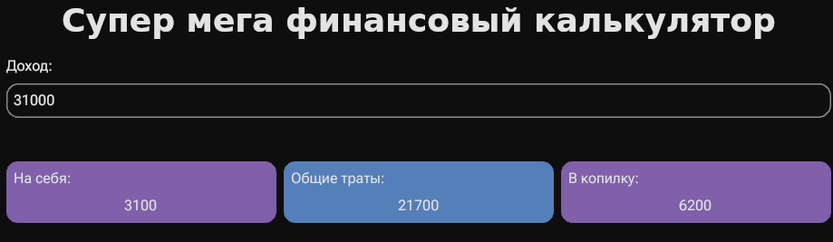

# Лабораторная работа №4

Так как функционал, необходимый для выполнения работы уже был реализован в [лабораторной работе №2](../lab2/), то достаточно рассмотреть ее. В ней введенная строка обрабатывается на то, является ли она числом и с каждым интпутом пересчитывается все позиции.

